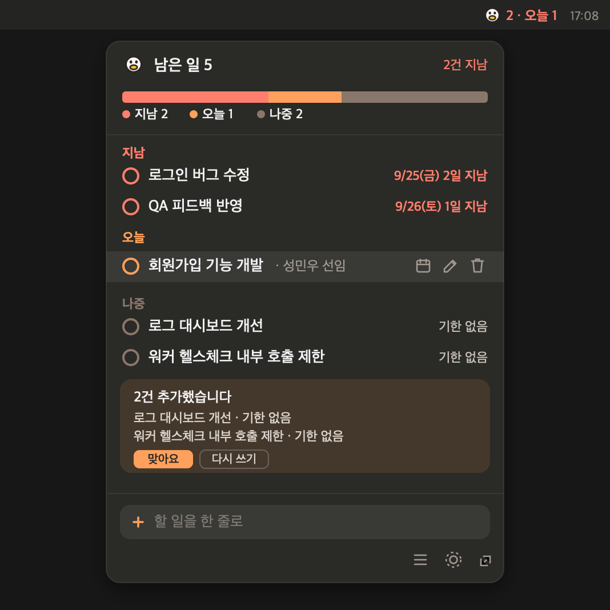

# tasklet

A personal task memo that lives in the macOS menu bar. Write one line and Claude Haiku pulls out the task, who asked for it, and when it is due.

[한국어](README.md)



## Overview

Write it down the way you heard it.

```
"Sung asked me to finish the signup work by Tuesday"
  →  Signup feature · Sung · Tue 9/29 (D-2)
```

The menu bar always shows how many tasks are overdue and due today. Click it and the list opens, most urgent first.

## How it works

Swift draws the screen. The Go CLI does everything else.

```
Tasklet.app (SwiftUI)        menu bar + popover, re-reads state every 10s
        │
        ▼  tasklet <command> --json
tasklet (Go CLI)             parsing, date math, storage, locking
        ├──→ claude -p --model haiku      reads the sentence (3-12s)
        └──→ ~/.tasklet/tasks.json        flock + atomic rename
```

Date math is not left to the LLM. Haiku only extracts meaning, such as `{"kind":"weekday","value":"tue"}`, and Go turns that into a real date. LLMs get this wrong often, so it is pinned down by tests.

## Requirements

- Apple Silicon Mac, macOS 13 or later. Xcode is not needed, command line tools are enough
- Go 1.25 or later
- [Claude Code](https://claude.com/claude-code) CLI. A signed-in subscription is enough, no API key needed

## Install

```bash
git clone https://github.com/SungMinWoo/tasklet.git
cd tasklet
./macos/install.sh
```

The CLI is installed to `~/.local/bin/tasklet`, the app to `~/Applications/Tasklet.app`, and it starts at login.
To remove it, run `./macos/install.sh --uninstall`. Your data is kept.

## Usage

Click the character in the menu bar to open the popover.

- Type one line in the field at the bottom and press `⏎`
- To add several at once, click **☰**, paste, and press `⌘⏎`. One line becomes one task. Lines are parsed concurrently, so three lines take about as long as one
- Hover a row for **due date, rewrite, delete**. Click the **○** on the left to complete it
- When a due date is ambiguous, for example when "Tuesday" is today, a confirmation card says so

The same things work from the terminal.

| Command | What it does |
|---|---|
| `tasklet add "<sentence>"` | Add one task |
| `tasklet add --batch [text]` | Add several at once. Reads stdin when no text is given |
| `tasklet list [--all]` | List tasks. `--all` includes completed ones |
| `tasklet done <id>` | Complete |
| `tasklet delete <id>...` | Delete. Accepts several ids |
| `tasklet edit <id>` | Rewrite the original sentence and parse it again |
| `tasklet due <id> <spec>` | Change only the due date (`+1d`, `eow`, `next_eow`, `none`, …) |
| `tasklet theme <name>` · `tasklet mascot <name>` | 5 themes · 7 characters |
| `tasklet version` | Show the version |

Note that the extraction prompt is written and tested in Korean. English input is not verified yet.

## Data

| What | Where |
|---|---|
| Tasks | `~/.tasklet/tasks.json` |
| Settings (theme, character) | `~/.tasklet/config.json` |

Both are plain JSON you can read and edit. Writes take an `flock` and then `rename` a temporary file, so an interrupted write never leaves half a file behind.

## Development

```bash
go test ./...                 # 113 cases (date math, storage, concurrency, response parsing)
go build -o bin/tasklet ./cmd/tasklet
./macos/build.sh --run        # build the SwiftUI app and run it
```

## License

[MIT](LICENSE)
